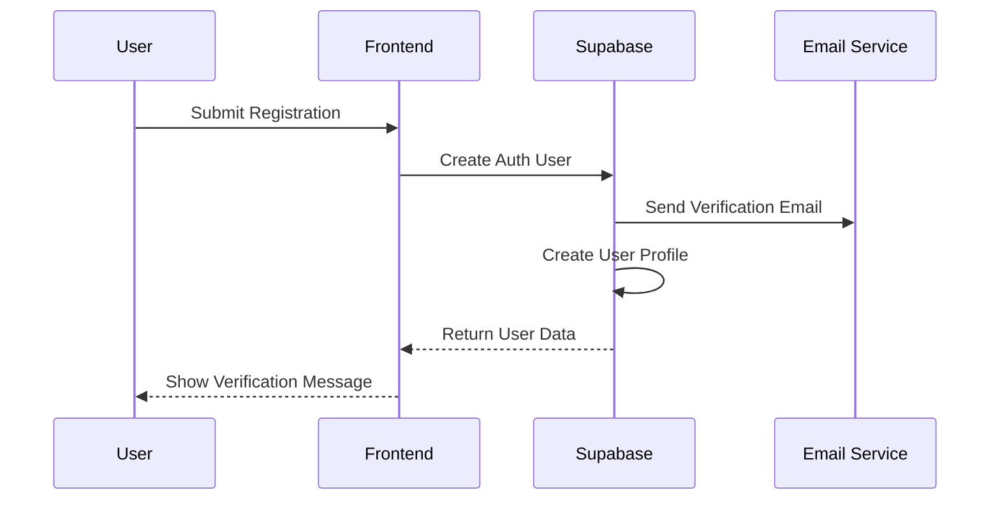
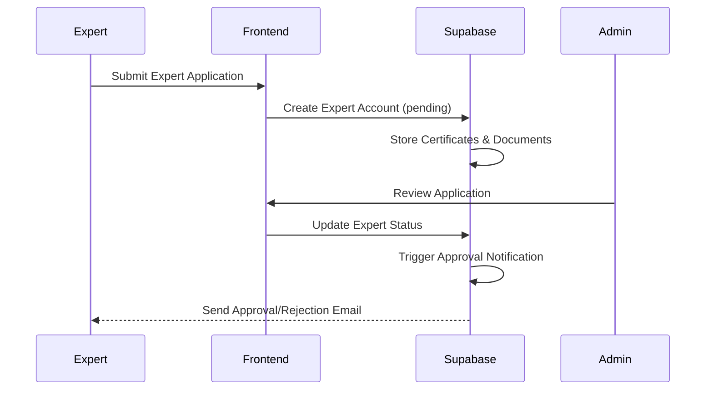
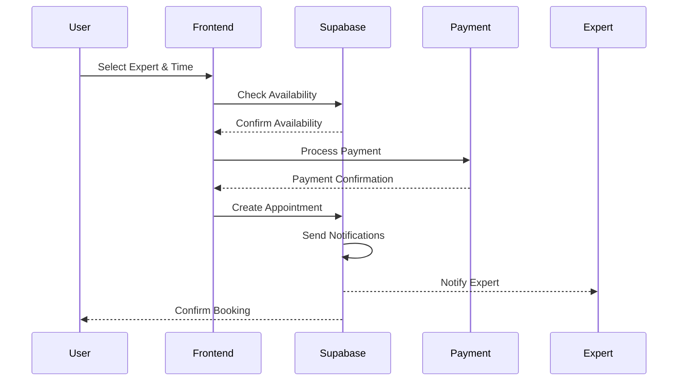

# Architecture Documentation

## Project Overview

IFindLife is a comprehensive wellness and mental health platform that connects users with certified experts, coaches, and volunteers for audio/video consultations, programs, and guidance. The platform is built as a modern web application with a React frontend and Supabase backend.

## Technology Stack

### Frontend
- **Framework**: React 18.3.1 with TypeScript
- **Build Tool**: Vite 5.4.1
- **Styling**: Tailwind CSS 3.4.11 with shadcn/ui components
- **Routing**: React Router DOM 6.26.2
- **State Management**: React Context API + React Query (TanStack Query 5.56.2)
- **UI Library**: Radix UI primitives with custom shadcn/ui implementations
- **Real-time Communication**: Agora RTC SDK 4.23.2

### Backend & Infrastructure
- **Backend as a Service**: Supabase
  - **Database**: PostgreSQL with Row Level Security (RLS)
  - **Authentication**: Supabase Auth
  - **File Storage**: Supabase Storage
  - **Edge Functions**: Deno-based serverless functions
- **Payment Processing**: Razorpay integration
- **Email Services**: Resend API
- **Real-time Features**: Supabase Realtime subscriptions

### Development Tools
- **Package Manager**: npm/bun
- **Linting**: ESLint 9.9.0
- **Type Checking**: TypeScript 5.5.3
- **CSS Processing**: PostCSS with Autoprefixer

## System Architecture

### High-Level Architecture

```
┌─────────────────┐    ┌─────────────────┐    ┌─────────────────┐
│   React Client  │    │   Supabase      │    │  Third-Party    │
│                 │    │                 │    │  Services       │
│ • User Interface│◄──►│ • PostgreSQL DB │◄──►│ • Razorpay      │
│ • State Mgmt    │    │ • Auth Service  │    │ • Resend        │
│ • Routing       │    │ • Storage       │    │ • Agora RTC     │
│ • API Calls     │    │ • Edge Functions│    │                 │
└─────────────────┘    └─────────────────┘    └─────────────────┘
```

### Frontend Architecture

#### Component Structure
```
src/
├── components/           # Reusable UI components
│   ├── ui/              # Base shadcn/ui components
│   ├── admin/           # Admin dashboard components
│   ├── expert/          # Expert-specific components
│   ├── user/            # User-specific components
│   ├── favorites/       # Favorites management
│   └── notifications/   # Notification system
├── pages/               # Route-level page components
├── contexts/            # React Context providers
├── hooks/               # Custom React hooks
├── lib/                 # Utility libraries
├── types/               # TypeScript type definitions
├── utils/               # Helper functions
└── integrations/        # External service integrations
    └── supabase/        # Supabase client and types
```

#### Authentication Architecture

The application implements a sophisticated multi-role authentication system:

**Authentication Flow:**
1. **SimpleAuthContext**: Primary authentication provider
2. **Role-based Login**: Separate login flows for Users and Experts
3. **Session Management**: Persistent sessions with role preferences
4. **Profile Loading**: Dynamic profile loading based on user type

**User Roles:**
- **User**: Regular platform users seeking wellness services
- **Expert**: Certified professionals providing services
- **Admin**: Platform administrators with management privileges

**Authentication States:**
```typescript
type SessionType = 'none' | 'user' | 'expert' | 'dual';

interface SimpleAuthContextType {
  isAuthenticated: boolean;
  isLoading: boolean;
  user: User | null;
  session: Session | null;
  userType: SessionType;
  userProfile: UserProfile | null;
  expert: ExpertProfile | null;
}
```

#### State Management Strategy

**Primary State Management:**
- **React Context**: Authentication, user profiles, expert data
- **React Query**: Server state, caching, and synchronization
- **Local State**: Component-specific state with useState/useReducer

**Key Context Providers:**
- `SimpleAuthProvider`: Core authentication and user management
- `ExpertPresenceProvider`: Real-time expert availability tracking
- `FavoritesProvider`: User favorites management
- `SecureAdminAuthProvider`: Separate admin authentication

### Backend Architecture (Supabase)

#### Database Schema

**Core Tables:**
- `users`: User profiles and account data
- `expert_accounts`: Expert profiles and verification status
- `appointments`: Booking and scheduling system
- `call_sessions`: Audio/video call tracking
- `messages`: In-platform messaging system
- `user_reviews`: Review and rating system
- `services`: Available wellness services
- `programs`: Structured wellness programs

**Authentication & Security:**
- `admin_accounts`: Admin user management
- `user_favorites`: User preference tracking
- `user_transactions`: Payment and billing history
- `referrals`: Referral program management

#### Row Level Security (RLS)

The database implements comprehensive RLS policies:

```sql
-- Example User Data Access
CREATE POLICY "Users can view their own profile data" 
ON public.users FOR SELECT 
USING (auth.uid() = id);

-- Example Expert Data Access  
CREATE POLICY "Experts can view their own data" 
ON public.expert_accounts FOR SELECT 
USING (auth_id = auth.uid());

-- Example Admin Access
CREATE POLICY "Admins can view all users" 
ON public.users FOR SELECT 
USING (is_any_admin());
```

#### Edge Functions

**Available Functions:**
- `admin-auth`: Admin authentication and authorization
- `create-razorpay-order`: Payment order creation
- `verify-razorpay-payment`: Payment verification
- `razorpay-webhook`: Payment webhook handling
- `send-appointment-notification`: Notification system
- `schedule-appointment-reminders`: Automated reminders

**Function Configuration:**
```toml
[functions.admin-auth]
verify_jwt = false

[functions.create-razorpay-order]
verify_jwt = true
```

### Real-time Communication

#### Agora RTC Integration

The platform uses Agora RTC SDK for audio/video communications:

**Call Types:**
- Audio consultations
- Video consultations
- Group sessions (planned)

**Call Management:**
```typescript
interface CallState {
  localAudioTrack: ILocalAudioTrack | null;
  localVideoTrack: ILocalVideoTrack | null;
  remoteUsers: IAgoraRTCRemoteUser[];
  client: IAgoraRTCClient | null;
  isJoined: boolean;
  isMuted: boolean;
  isVideoEnabled: boolean;
  isAudioEnabled: boolean;
}
```

**Call Features:**
- Real-time audio/video
- Screen sharing capability
- Call recording (planned)
- Quality metrics tracking
- Billing integration with call duration

### Data Flow Architecture

#### User Registration & Onboarding


#### Expert Approval Process


#### Appointment Booking Flow


## Security Architecture

### Authentication Security
- **JWT Tokens**: Secure session management
- **Email Verification**: Required for account activation
- **Role-based Access**: Strict role separation
- **Session Timeout**: Automatic session expiration

### Data Protection
- **Row Level Security**: Database-level access control
- **Input Validation**: Client and server-side validation
- **CORS Configuration**: Restricted cross-origin requests
- **HTTPS Only**: Encrypted data transmission

### Payment Security
- **PCI Compliance**: Through Razorpay integration
- **Webhook Verification**: Secure payment confirmations
- **Transaction Logging**: Complete audit trail

## Performance Architecture

### Frontend Performance
- **Code Splitting**: Route-based chunk loading
- **Lazy Loading**: Component and image lazy loading  
- **React Query**: Intelligent caching and background updates
- **Optimistic Updates**: Immediate UI feedback

### Backend Performance
- **Connection Pooling**: Efficient database connections
- **Query Optimization**: Indexed database queries
- **Edge Functions**: Serverless scaling
- **CDN Integration**: Fast asset delivery

### Monitoring & Observability
- **Error Tracking**: Client and server error monitoring
- **Performance Metrics**: Real-time performance tracking
- **Usage Analytics**: User behavior insights
- **Health Checks**: System health monitoring

## Deployment Architecture

### Development Environment
```bash
# Local development setup
npm install
npm run dev  # Starts Vite dev server on :8080
```

### Production Deployment
- **Frontend**: Vite build with optimized bundles
- **Backend**: Supabase managed infrastructure
- **CDN**: Static asset distribution
- **DNS**: Custom domain support (when configured)

### CI/CD Pipeline
- **Code Quality**: ESLint and TypeScript checking
- **Build Process**: Automated Vite builds
- **Deployment**: Continuous deployment through Lovable platform
- **Testing**: Component and integration testing (planned)

## Scalability Considerations

### Horizontal Scaling
- **Supabase Auto-scaling**: Automatic database scaling
- **Edge Functions**: Serverless function scaling
- **CDN Distribution**: Global content delivery

### Vertical Scaling  
- **Database Performance**: Query optimization and indexing
- **Memory Management**: Efficient React state management
- **Bundle Optimization**: Code splitting and tree shaking

## Future Architecture Considerations

### Planned Enhancements
- **Mobile Applications**: React Native implementation
- **Advanced Analytics**: Comprehensive business intelligence
- **AI Integration**: Smart matching and recommendations
- **Multi-language Support**: Internationalization
- **Advanced Notifications**: Push notifications and SMS

### Technical Debt Management
- **Code Auditing**: Regular code quality assessments
- **Dependency Updates**: Systematic dependency management
- **Security Reviews**: Regular security audits
- **Performance Optimization**: Ongoing performance improvements

## Development Guidelines

### Code Organization
- **Feature-based Structure**: Components organized by functionality
- **Consistent Naming**: Clear, descriptive naming conventions
- **Type Safety**: Comprehensive TypeScript usage
- **Component Reusability**: Maximize component reuse

### Best Practices
- **Single Responsibility**: Each component has a single purpose
- **Immutable State**: Prevent direct state mutations
- **Error Boundaries**: Graceful error handling
- **Accessibility**: WCAG compliance for all components

### Testing Strategy (Planned)
- **Unit Testing**: Component-level testing
- **Integration Testing**: API and flow testing
- **E2E Testing**: Complete user journey testing
- **Performance Testing**: Load and stress testing

## API Documentation

### Supabase Integration
```typescript
// Example API usage
import { supabase } from '@/integrations/supabase/client';

// User operations
const { data: users } = await supabase
  .from('users')
  .select('*')
  .eq('id', userId);

// Expert operations  
const { data: experts } = await supabase
  .from('expert_accounts')
  .select('*')
  .eq('status', 'approved');
```

### Edge Function Integration
```typescript
// Example edge function call
const { data, error } = await supabase.functions.invoke('create-razorpay-order', {
  body: { amount: 1000, currency: 'INR' }
});
```

This architecture document provides a comprehensive overview of the IFindLife platform's technical implementation, serving as a reference for development, maintenance, and future enhancements.